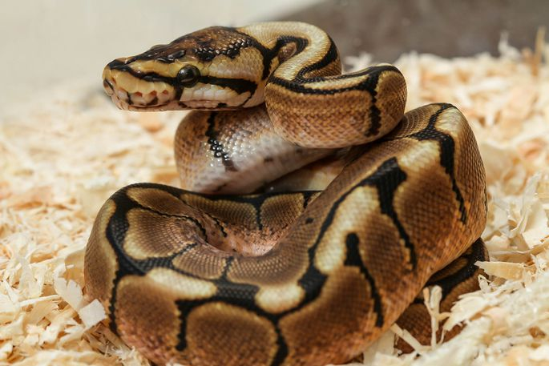

Kuningpüüton
========================

Kuningpüüton (Python regius) on maoliik. Need kägistajamaod on levinud Aafrikas.[2] Ta on Aafrikas elavatest püütoniliikidest väikseim ja taltsa iseloomu tõttu ka populaarne lemmikloom. Ohu korral rullub ta kerra, mille järgi nimetatakse teda, peamiselt Ameerikas, kerapüütoniks.[3] Kuningpüütoni liiginimi (ladina keeles regius) tuleneb asjaolust, et Aafrika valitsejad kandsid seda liiki madusid kaelaehtena. 

**************************
Levik
**************************

Liik on levinud Aafrika mandril Senegalis, Malis, Guinea-Bissaus, Guineas, Sierra Leones, Libeerias, Elevandiluurannikul, Ghanas, Tšaadis, Beninis ja Nigeerias ning Kamerunist ja Kesk-Aafrika Vabariigist kuni Sudaani ja Ugandani. Algses liigikirjelduses ei antud kindlat tüüpelupaika

**************************
Toitumine
**************************
Looduses toituvad nad peamiselt väikestest imetajatest, näiteks rottidest ja hiirtest. Nooremad isendid võivad toituda ka lindudest. Saakloomi varitseb kuningpüüton puuoksale peitununa ja saaklooma sobivasse haardekaugusse jõudmisel laseb oma kere eesosa justkui puuoksalt alla rippuda.[12]. Loodusest püütud ja lemmikloomaks müüdud isendid on tavaliselt toidu suhtes väga valivad, kuid vangistuses siginud ja kasvanud isendid söövad nii kodurotte kui ka -hiiri nii elavalt, surnult kui sügavkülmast ülessoojendatult.[5] Terraariumis olevale maole elava toidu andmine võib aga maole ohtlik olla, kuna maol ei ole tihtilugu piisavalt ruumi ennast, näiteks raevuka roti teravate küüniste eest, kaitsta. Seetõttu ei soovitata vähese kogemusega maopidajatel lemmiklooma menüüsse elussööta lisada. Püütonile antav toidupala peaks olema enam-vähem sama suur või pisut suurem kui mao keha kõige jämedam koht. Kuningpüütonid on tuntud väga pirtsaka toitumise poolest ja nad võivad söömata olla mitu kuud, eriti just talvisel paaritumisperioodil. Kuigi selline käitumine on tavaline, tuleks siiski mao eest hoolitseda ja jälgida, et loom liiga palju oma kehakaalust ei kaotaks. Kuigi vangistuses elavad kuningpüütonid peavad sööma ainult kord nädalas, annavad mõned maopidajad neile süüa kaks korda nädalas või rohkem kui ühe söögipala korraga. Sellise tegevuse tagamõtteks on mao kehakaalu ja pikkuse suurendamine. Kuningpüütonite värsked omanikud peaksid kindlasti kõrva taha panema, et nende lemmikloom ei söö ajal, mil ta valmistub kestuma. Toidust keeldumises võivad süüdi olla ka parasiidid. Muud põhjused toitumisest keeldumiseks võivad olla näiteks liigne käeshoidmine, liiga kõrge või madal terraariumi temperatuur või niiskus[13] ja peidupaikade puudumine.[14] Harvad pole ka juhtumid, mil loodusest püütud kuningpüütonid keelduvad vangistuses söömast ja surevad. 
NO TERE TALV

.. code-block:: python

   print("Hssss")

**************************
